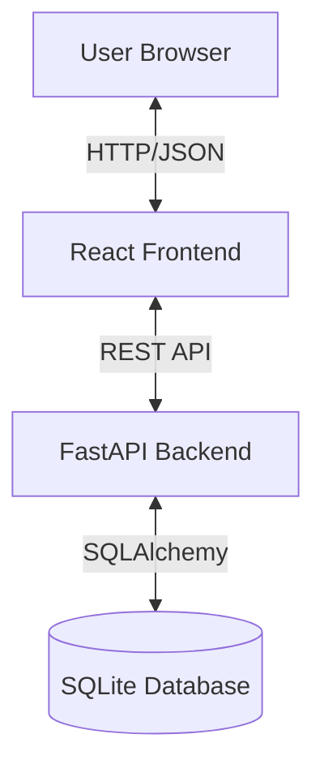

# Architectural Design Document (ADD)
## Project: Minimalist To-Do Application

### 1. Introduction
This document describes the high-level architecture of the Minimalist To-Do Application. The system is designed as a modern Single Page Application (SPA) communicating with a RESTful backend API.

### 2. System Overview
The application follows a client-server architecture:
- **Client (Frontend)**: React.js application running in the user's browser.
- **Server (Backend)**: FastAPI application running on a Python server.
- **Database**: SQLite database for persistent storage.

### 3. Component Architecture

#### 3.1 Frontend (Client-Side)
- **Technology**: React 18, Vite, Vanilla CSS.
- **Structure**:
    - `App.jsx`: Main container and state manager.
    - `components/`: Reusable UI elements (`TodoInput`, `TodoList`, `TodoItem`).
    - `api.js`: Axios instance for API communication.
- **Key Concepts**:
    - **State Management**: React `useState` and `useEffect` hooks.
    - **Styling**: CSS Variables and Glassmorphism techniques managed in `index.css`.

#### 3.2 Backend (Server-Side)
- **Technology**: Python 3.8+, FastAPI, Uvicorn.
- **Structure**:
    - `main.py`: Application entry point, CORS configuration, and API routes.
    - `models.py`: SQLAlchemy ORM definitions mapping Python classes to database tables.
    - `schemas.py`: Pydantic models for request/response validation and serialization.
    - `crud.py`: Database access layer separating business logic from API routes.
    - `database.py`: Database connection and session management.

### 4. Data Design

#### 4.1 Database Schema
The system uses a relational model with a single primary entity: `Todo`.

**Entity: Todo**
| Field       | Type      | Description             |
|-------------|-----------|-------------------------|
| `id`        | Integer   | Primary Key, Auto-inc   |
| `title`     | String    | Task title (Required)   |
| `description`| String   | Optional details        |
| `completed` | Boolean   | Task status (Default: False) |

#### 4.2 API Contract
All API data is exchanged in JSON format.
- `GET /todos/`: Retrieve all tasks.
- `POST /todos/`: Create a new task.
- `PUT /todos/{id}`: Update a task (e.g., mark as completed).
- `DELETE /todos/{id}`: Remove a task.

### 5. Deployment Constraints
- **Local Execution**: The system is configured for local deployment using the provided `run_app.bat` script.
- **Environment**: Requires Node.js and Python environments.
- **Persistence**: Data is stored in a local `todos.db` file within the `backend/` directory.
